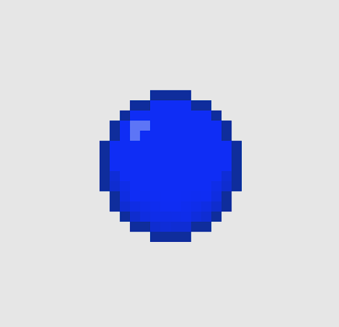

<div align="center">
    <h1>Jogo Base Defense</h1>
    
    <p>Um jogo desenvolvido em C++, com a biblioteca SFML.</p>
</div>

# Sobre o jogo
BaseDefense é totalmente desenvolvido em C++ e faz uso da biblioteca gráfica <a href="https://www.sfml-dev.org/">SFML</a>.
## Sobreviva o máximo possível 
Durante o jogo, inimigos surgem nas bordas do mapa para destruir você ou sua base. Cada nível possui um tempo determinado. Ao fim da leva, uma nova onda de inimigos irá surgir. O objetivo do jogador é sobreviver a maior quantidade de níveis possível, à medida que a dificuldade aumenta.
## Combate e upgrades
O jogador começa com uma quantidade limitada de vida e um carregamento inicial de munição. Para proteger a base, o jogador deve eliminar os inimigos que surgem no mapa. Ao serem derrotados, os inimigos podem largar caixas de munição ou de curativos. O jogador pode se movimentar pela base livremente e os inimigos podem causar dano tanto ao jogador como à base. O jogo termina caso o jogador ou a base cheguem a 0 de vida.

A cada nível, o jogador pode escolher um entre alguns upgrades disponíveis. Estes incluem upgrades da base, como escudo, cura e velocidade de regeneração e upgrades para o jogador, como vida, velocidade, velocidade de ataque e velocidade de projétil.

<div align="center">
    
</div>

## Inimigos
### Inimigo 1 (vermelho)
Inimigo inicial do jogo. Seu objetivo é perseguir e destruir o jogador.


### Inimigo 2 (azul)
Uma versão mais ágil do inimigo 1. Persegue o jogador com muito mais velocidade e atira mais rápido.



### Inimigo 3 (roxo)
Um oponente imprevisível. Seu objetivo é destruir unicamente a base, pode se teletransportar pelo mapa, inclusive para dentro da base.


### Inimigo 4 (dourado)
Dourado é o inimigo mais resistente, porém mais lento do jogo. Se move com pouca velocidade, mas com uma alta cadência de tiros que causam dano com base no escudo da base. Ataca somente a base.


## Controles
 - Movimentar: mouse (direito);
 - Atirar: Q;
 - Pausar: Esc;

# Compilação e execução
 Execute o comando '*make*' no diretório raiz do projeto:
```
make
```
 Execute o jogo com o arquivo '*game.exe*' gerado na pasta bin:
```
.\bin\game.exe
```
 Recursos utilizados na compilação:
 - **MinGW-w64** (gcc 13.1.0)
 - **SFML 2.6.1** (versão já instalada no repositório)
 - **MakeFile**

# Assets
 Música e efeitos sonoros:
 - https://opengameart.org/content/63-digital-sound-effects-lasers-phasers-space-etc
 - https://opengameart.org/content/tower-defense-theme 
 - https://opengameart.org/content/fast-fight-battle-music

 Sprites e elementos gráficos por <a href="https://github.com/Tiegow">Tiego Rafael</a>